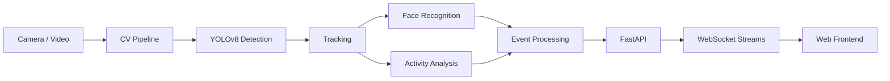

# 🔍 Civic Behaviour Monitoring System

> A real-time computer-vision prototype that combines detection, face recognition, activity analysis and browser communication into one modular application.

[](https://www.python.org/)
[](https://fastapi.tiangolo.com/)
[](https://developer.mozilla.org/en-US/docs/Web/API/WebSockets_API)
[](https://opencv.org/)
[](https://github.com/Blood79/Civic-Behaviour-Monitoring-System)

## 🎯 What it does

The system is structured as a modular CV pipeline rather than a single notebook. It processes video, detects people, tracks them, identifies enrolled faces, analyzes activities and sends events to a web frontend in real time.

### Core capabilities

- **Person detection & tracking** with YOLOv8 and a tracking module
- **Face recognition** using InsightFace
- **Activity / pose analysis** using MediaPipe-based modules
- **FastAPI backend** for HTTP endpoints and orchestration
- **WebSockets** for live frames and alert events
- **Frontend integration** for monitoring and visualization

## 🧩 Architecture



## 🛠️ Tech stack

| Layer | Technology |
|---|---|
| Computer Vision | YOLOv8, InsightFace, MediaPipe |
| Backend | Python, FastAPI |
| Real-time | WebSockets |
| Frontend | React / TypeScript components |
| Development | Git, REST APIs |

## 🚀 Quick start

### Backend

```bash
cd backend
python -m venv venv
```

**Windows**

```bash
venv\Scripts\activate
```

**macOS / Linux**

```bash
source venv/bin/activate
```

Install dependencies and start the API:

```bash
pip install -r requirements.txt
uvicorn main:app --reload --port 8000
```

The first run may download the required model assets, including YOLOv8 and the InsightFace model pack.

### Frontend

```bash
cd frontend
npm install
npm run dev
```

The development frontend is configured for `http://localhost:3000`.

## 👤 Face enrollment

A face can be enrolled through the backend endpoint:

```bash
curl -X POST http://localhost:8000/enroll \
  -F "name=YourName" \
  -F "file=@/path/to/your/photo.jpg"
```

Or use Postman / Thunder Client.

## 🔌 WebSocket contracts

### Video stream

`/ws/video` → browser

```json
{ "type": "frame", "data": "<base64 JPEG string>" }
```

### Alerts

`/ws/alerts` → browser

```json
{
  "type": "alert",
  "person_name": "Anshuman",
  "activity": "spitting",
  "score_delta": -10,
  "new_score": 90,
  "id_confidence": 0.821
}
```

## 🗺️ Development roadmap

The codebase is being developed in stages around the CV pipeline, event processing and frontend integration.

- [x] Project structure and API skeleton
- [x] Model integration points
- [x] Face enrollment endpoint
- [x] WebSocket contracts
- [ ] Production-grade activity classifier
- [ ] Multi-camera support
- [ ] GPU deployment profile
- [ ] Persistent event storage and analytics

## 🔐 Responsible-use note

This is a technical prototype for experimentation with computer vision and real-time event processing. Any real deployment involving identity, monitoring or behavioural scoring should include appropriate consent, access controls, privacy safeguards and human review.

## 📌 Project status

**Prototype / active development** — the repository is intended to demonstrate end-to-end CV architecture, integration and deployment-oriented thinking rather than claim production readiness.
